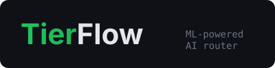

<p align="center">
  
</p>

# TierFlow — ML-Powered AI Model Router

**Stop overpaying for AI. Route every request to the right model — automatically, with your own API keys.**

[](LICENSE)
[](test/)
[](package.json)

---

## Why TierFlow?

**You already have API keys. Why pay someone else to use them?**

| Pain                                    | How TierFlow Fixes It                                                                   |
| --------------------------------------- | --------------------------------------------------------------------------------------- |
| Every message hits your expensive model | **ML-powered classifier** routes to 8 specialized categories. Save 60-80%.              |
| No control over routing                 | **Mode overrides** — `/max`, `/simple`, `[code]` to force a category.                   |
| Proxies that hang                       | **Per-tier timeouts + auto-fallback** to secondary models.                              |
| PII leaks to third-party providers      | **Built-in PII scrubbing** — auto-redact before forwarding, auto-rehydrate on response. |
| Hardcoded configs                       | **External JSON config** — edit and hit `/reload-config`. No restart.                   |

## Features

- **ML-powered routing** — 8-category classifier via LLMRouter service (~40ms), falls back to 15-dimension keyword scorer
- **PII scrubbing** — 15 detection patterns (emails, API keys, SSNs, credit cards, IPs, PEM keys, etc.), type-preserving placeholders, AES-256-GCM encryption, streaming-safe rehydration
- **CtxPack compression** — 6 passes (ANSI strip, whitespace collapse, JSON compact, line dedup, comment strip, stack trace trim), 30-70% token savings
- **Response cache** — LRU with TTL, SHA-256 exact-match, `X-Cache: HIT/MISS` headers
- **Mode overrides** — `/max`, `/simple`, `[code]`, `deep mode:` etc. to force routing
- **Agentic routing** — auto-detects tool calls and routes to agentic-capable models
- **Web dashboard** — built-in monitoring at `/dashboard` with auto-refresh
- **Docker Compose** — one-command startup for router + ML classifier
- **CLI** — `npx tierflow --init`, `--check`, `--port`
- **Zero runtime dependencies** — pure Node.js built-ins
- **OpenAI-compatible API** — drop-in `/v1/chat/completions` proxy
- **40 tests** — unit (cache, router, config) + integration (mock ML classifier)

## How It Works

```
Your App --> TierFlow (:18800) --> ML Classifier (:18801) --> Best Model

                    8 Categories:
                    simple_chat   --> Gemini Flash Lite   (near-zero cost)
                    general       --> DeepSeek V3         (balanced)
                    coding        --> Qwen3 Coder         (free)
                    reasoning     --> GPT-oss / DeepSeek R1 (deep thinking)
                    creative      --> Step 3.5 Flash      (free)
                    data          --> Gemini Flash Lite    (cheap)
                    agentic       --> DeepSeek V3         (tool-capable)
                    transcription --> Gemini Flash Lite    (cheap)

                    Fallback: 15-dimension keyword scorer (<1ms)
```

The ML classifier uses sentence embeddings (all-MiniLM-L6-v2) + KNN to categorize queries in ~40ms. Each category maps to the cheapest model that handles it well. Models and mappings are fully configurable.

## Quick Start

### Option A: npx (recommended)

```bash
npx tierflow --init     # generate config template
npx tierflow            # start the router
```

### Option B: Clone & Build

```bash
git clone https://github.com/frdaniel76/tierflow.git
cd tierflow
npm install
npm run build
npm start
```

### Option C: Docker

```bash
docker compose up -d      # starts router + ML classifier
```

See [docs/docker.md](docs/docker.md) for details.

### Use It

Point any OpenAI-compatible client at `http://localhost:18800`:

```bash
# Health check
curl http://localhost:18800/health

# Chat (auto-routes to best model)
curl http://localhost:18800/v1/chat/completions \
  -H "Content-Type: application/json" \
  -d '{"model":"auto","messages":[{"role":"user","content":"Hello!"}]}'

# Open dashboard
open http://localhost:18800/dashboard
```

## Configuration

TierFlow looks for config in this order:

1. `TIERFLOW_CONFIG` environment variable
2. `./tierflow.config.json` (working directory)
3. `~/.config/tierflow/config.json`

If no config file exists, built-in defaults apply.

### Config File Structure

```json
{
  "port": 18800,
  "host": "127.0.0.1",
  "providers": {
    "anthropic": {
      "baseUrl": "https://api.anthropic.com",
      "api": "anthropic",
      "auth": { "type": "env", "key": "ANTHROPIC_API_KEY" }
    },
    "openrouter": {
      "baseUrl": "https://openrouter.ai/api/v1",
      "api": "openai",
      "auth": { "type": "env", "key": "OPENROUTER_API_KEY" },
      "pii": true,
      "compress": true
    },
    "ollama": {
      "baseUrl": "http://localhost:11434/v1",
      "api": "openai",
      "auth": { "type": "none" }
    }
  },
  "categories": {
    "simple_chat": {
      "primary": "openrouter/google/gemini-2.5-flash-lite",
      "fallback": [],
      "timeout": 30000
    },
    "coding": { "primary": "openrouter/qwen/qwen3-coder:free", "fallback": [], "timeout": 120000 },
    "reasoning": { "primary": "anthropic/claude-opus-4-6", "fallback": [], "timeout": 120000 }
  },
  "tiers": {
    "SIMPLE": { "primary": "openrouter/google/gemini-2.5-flash-lite", "fallback": [] },
    "MEDIUM": { "primary": "openrouter/deepseek/deepseek-v3.2", "fallback": [] },
    "COMPLEX": { "primary": "anthropic/claude-sonnet-4-5", "fallback": [] },
    "REASONING": { "primary": "anthropic/claude-opus-4-6", "fallback": [] }
  },
  "mlClassifier": {
    "url": "http://127.0.0.1:18801/classify",
    "timeout_ms": 500,
    "fallback_category": "general"
  },
  "cache": { "enabled": true, "ttl_seconds": 300, "max_entries": 5000 }
}
```

Reload without restart: `curl -X POST http://localhost:18800/reload-config`

See [docs/providers.md](docs/providers.md) for provider cookbook (Groq, Together, Mistral, DeepSeek, Ollama, etc.).

## Mode Overrides

Force a category when you know better than the classifier:

```
/simple What's 2+2?
/max Prove that P(A|B) = P(B|A)P(A)/P(B)
/code Write a binary search in TypeScript
[creative] Write a haiku about debugging
deep mode: Analyze this distributed system for race conditions
```

| Aliases                             | Routes to   |
| ----------------------------------- | ----------- |
| `simple`, `basic`, `cheap`          | simple_chat |
| `medium`, `balanced`                | general     |
| `complex`, `advanced`, `code`       | coding      |
| `max`, `reasoning`, `think`, `deep` | reasoning   |
| `creative`                          | creative    |
| `data`                              | data        |

The prefix is **stripped** before forwarding — the LLM never sees it.

## Endpoints

| Endpoint               | Method | Description                                          |
| ---------------------- | ------ | ---------------------------------------------------- |
| `/v1/chat/completions` | POST   | Main chat endpoint (OpenAI-compatible)               |
| `/v1/models`           | GET    | List available models (config-driven)                |
| `/health`              | GET    | Health check with uptime, stats, version             |
| `/stats`               | GET    | Request statistics (tiers, models, PII, cache, cost) |
| `/config`              | GET    | View current config (secrets redacted)               |
| `/reload`              | POST   | Reload auth keys + config                            |
| `/reload-config`       | POST   | Reload config file + auth                            |
| `/dashboard`           | GET    | Web monitoring dashboard                             |

## The Routing Engine

### v2: ML Classifier (Primary)

Calls the LLMRouter service (`localhost:18801`) which uses sentence-transformer embeddings + KNN to classify queries into 8 categories in ~40ms. Requires the companion `llmrouter-service` (Python).

### v1: 15-Dimension Keyword Scorer (Fallback)

When the ML service is unavailable, falls back to a rule-based scorer across 15 weighted dimensions:

| Dimension           | Weight | What It Measures            |
| ------------------- | ------ | --------------------------- |
| reasoningMarkers    | 0.25   | Logical reasoning keywords  |
| technicalTerms      | 0.18   | Specialized vocabulary      |
| codePresence        | 0.12   | Programming keywords        |
| multiStepPatterns   | 0.12   | Multi-step instructions     |
| domainSpecificity   | 0.12   | Domain-specific terms       |
| simpleIndicators    | 0.10   | Greetings, simple questions |
| imperativeVerbs     | 0.06   | Action verbs                |
| creativeMarkers     | 0.05   | Creative writing keywords   |
| questionComplexity  | 0.05   | Question structure          |
| tokenCount          | 0.04   | Message length              |
| constraintCount     | 0.04   | Constraint indicators       |
| agenticTask         | 0.04   | Agentic/tool keywords       |
| outputFormat        | 0.03   | Output format requests      |
| referenceComplexity | 0.02   | Reference patterns          |
| negationComplexity  | 0.01   | Negation patterns           |

Multilingual keyword detection: English, Chinese, Japanese, Russian, German.

## PII Scrubbing

Enable per-provider with `"pii": true` in config. 15 detection patterns across 5 ordered passes:

| Pass                          | Patterns                                                | Categories              |
| ----------------------------- | ------------------------------------------------------- | ----------------------- |
| 1. High-confidence structured | PEM blocks, API keys, connection strings, Bearer tokens | pem, apikey, conn, cred |
| 2. Structured identifiers     | Emails, credit cards, SSNs, UK NINOs                    | email, cc, ssn, nino    |
| 3. Semi-structured            | Phone numbers, IPv4/IPv6, UK postcodes, file paths      | phone, ip, post, path   |
| 4. PEM headers                | Stray PEM BEGIN lines                                   | pem                     |
| 5. Entropy catch-all          | password=, secret=, token= patterns                     | secret                  |

Placeholders are **type-preserving** (`p0{hex}@maildomain.com` for emails, `p0{hex}-placeholder-key` for API keys) so LLMs echo them correctly in tool calls. Encrypted with AES-256-GCM, memory-only.

Zero overhead when disabled (default).

## Project Structure

```
tierflow/
├── src/
│   ├── server.ts            # HTTP server, route handlers, stats
│   ├── provider.ts          # Multi-provider forwarding + SSE translation
│   ├── auth.ts              # API key management (env, file, keychain, none)
│   ├── config.ts            # Config loader + types
│   ├── models.ts            # Model catalog + pricing
│   ├── usage.ts             # Token usage + cost tracking
│   ├── logger.ts            # Logging
│   ├── dashboard.ts         # Built-in web dashboard
│   ├── cli.ts               # CLI entry point (npx tierflow)
│   ├── index.ts             # Library exports
│   ├── router/
│   │   ├── index.ts         # ML classifier + legacy scorer integration
│   │   ├── rules.ts         # 15-dimension keyword scorer
│   │   ├── selector.ts      # Tier → model selection + cost estimation
│   │   ├── config.ts        # Default routing config + weights
│   │   └── types.ts         # Category, Tier, RoutingDecision types
│   ├── pii/
│   │   ├── vault.ts         # AES-256-GCM encryption + type-preserving placeholders
│   │   ├── middleware.ts     # Scrub/rehydrate pipeline + streaming carry buffer
│   │   ├── patterns.ts      # 15 PII detection regexes
│   │   └── vault-store.ts   # Multi-session vault management
│   ├── compress/
│   │   ├── passes.ts        # 6 compression passes
│   │   └── middleware.ts     # Message-level compression
│   └── cache/
│       └── store.ts         # LRU cache with TTL + SHA-256 hashing
├── test/
│   ├── unit/                # Cache, router, config unit tests
│   ├── integration/         # Mock ML server integration tests
│   └── *.test.ts            # Legacy test files (PII, compression, etc.)
├── bench/                   # Benchmark suite (100 prompts)
├── demo/                    # Static comparison page
├── docs/                    # Documentation
├── Dockerfile               # Multi-stage Node.js build
├── docker-compose.yml       # Router + ML classifier stack
├── tierflow.config.example.json
└── package.json
```

## OpenClaw Integration

Add TierFlow as a provider in your OpenClaw config:

```json
{
  "providers": {
    "tierflow": {
      "baseUrl": "http://localhost:18800",
      "api": "openai-completions",
      "models": [{ "id": "auto" }]
    }
  },
  "agents": {
    "defaults": { "model": "tierflow/auto" }
  }
}
```

## Credits

Forked from [BlockRunAI/ClawRouter](https://github.com/BlockRunAI/ClawRouter) (MIT License). Original 15-dimension routing engine preserved and extended; x402 payment protocol removed. Credit to BlockRunAI for the classifier design.

**New in TierFlow:** ML-powered 8-category routing, PII scrubbing, CtxPack compression, response caching, web dashboard, CLI, Docker support.

## License

[MIT](LICENSE) — Copyright BlockRunAI (original) + frdaniel76 (TierFlow extensions)
